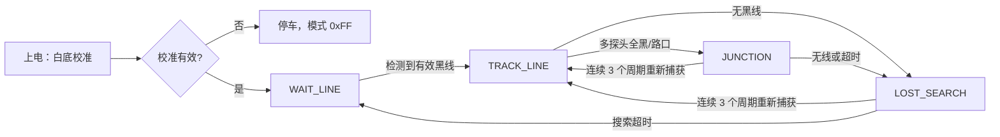

# 2025 八路巡线车：固件、调参与烧录手册

本文是 `codex/line-sensor-support` 分支上 2025 巡线车的唯一运行说明。它对应 **MSPM0G3507 + 八路 GPIO 数字灰度传感器 + AT8236 双电机驱动**，不是 CCD 巡线/云台工程，也不是 I2C 八路智能模块的 OLED 测试工程。

## 1. 当前版本与实车状态

当前源代码已经保留硬件 PWM、固定 10 ms 控制周期、平滑 PD 差速控制和分路口/丢线恢复状态机。最近两次过低速参数试验已回退：实际车的电机在 50 和 70 PWM 占空比附近不能可靠克服静摩擦，因此源码恢复到基准速度 100。

| 项目 | 当前源码状态 |
| --- | --- |
| 左右方向补偿 | 左轮反相 `MOTOR_LEFT_INVERT=1`；右轮正常 `MOTOR_RIGHT_INVERT=0` |
| 正常巡线基准速度 | `CAR_BASE_SPEED=100`（满量程 1000 的 10%） |
| 路口 / 丢线搜索速度 | 80 / 75 |
| 最近编译结果 | 恢复版 `smart_car.out` 已编译通过 |
| 最近板端烧录结果 | 恢复版下载因 XDS110 Error -260 未完成；因此开发板上的程序可能仍是此前的低速版本，重新连接后必须再烧录 |

> 不要仅凭仓库源码判断开发板已更新。每次修改后均应重新 Build、Flash，并以 DSLite 的 `Program verification successful` 或 CCS 下载成功提示为准。

## 2. 文件职责

| 文件 | 作用 | 是否建议手工修改 |
| --- | --- | --- |
| `firmware/mspm0-vehicle/empty.c` | 初始化、模式选择、SysTick 10 ms 调度 | 是 |
| `firmware/mspm0-vehicle/line_sensor.c` | 八路 GPIO 读取、上电校准、三次多数投票去抖 | 是 |
| `firmware/mspm0-vehicle/line_follow.c` | 状态机、位置 PD、差速和速度斜坡 | 是 |
| `firmware/mspm0-vehicle/keil/motor/motor.c` | AT8236 硬件 PWM 输出和方向切换 | 是 |
| `firmware/mspm0-vehicle/app_config.h` | 全部常用巡线/电机参数 | 是，调参只改此文件 |
| `firmware/mspm0-vehicle/empty.syscfg` | 引脚、TIMG PWM、SysTick 配置 | 仅硬件变更时修改 |
| `ti_msp_dl_config.c/.h` | SysConfig 自动生成 | 否，重新生成会覆盖 |

MSPM0 目录下的 C/H 文件为 GBK 编码。编辑器必须以 GBK（简体中文代码页）打开，不能整文件转成 UTF-8。

## 3. 硬件与引脚

### 3.1 八路 GPIO 灰度传感器

传感器从左到右为 X1~X8。运行期 `LineSensor_Data.value[0]` 对应 X1，`value[7]` 对应 X8。

| 通道 | MCU 引脚 | 原始位 |
| --- | --- | --- |
| X1（最左） | PA15 | bit7 |
| X2 | PA17 | bit6 |
| X3 | PA22 | bit5 |
| X4 | PA24 | bit4 |
| X5 | PA25 | bit3 |
| X6 | PA26 | bit2 |
| X7 | PA27 | bit1 |
| X8（最右） | PB20 | bit0 |

该方案按白底校准：上电时车辆必须放在白色背景上。程序连续采样 16 次，某位高电平次数不少于 8 次即记为白底模式；运行时使用 `raw XOR white_pattern`，统一得到 **1 = 黑线，0 = 白底**。每次原始读取还执行三次采样、二取三多数投票去抖。

校准模式为全黑（`white_pattern=0x00`）时会拒绝启动，`g_debug_follower_mode` 变为 `0xFF`，电机保持停止。首先检查车辆是否停在白底、传感器供电/连线和安装高度。

### 3.2 AT8236 双电机驱动

| 车轮 | 正向输入 | 反向输入 | 定时器 |
| --- | --- | --- | --- |
| 左轮 | PA12 / AIN1 | PA13 / AIN2 | TIMG0 |
| 右轮 | PA28 / BIN1 | PA31 / BIN2 | TIMG7 |

TIMG0、TIMG7 使用 32 MHz 时钟、16 分频和 1000 计数周期，PWM 频率为约 2 kHz。每个 H 桥一次只让一个输入输出 PWM，另一个输入固定为低，避免正反向同时有效。速度单位不是编码器闭环速度，而是 `0~1000` 的 PWM 占空比命令。

`MOTOR_LEFT_INVERT` 和 `MOTOR_RIGHT_INVERT` 用于适配接线/电机机械方向。修改后务必先悬空测试：给 `Motor_SetSpeeds(+120, +120)` 时，两轮应共同驱动车体向前；若方向不一致，只改对应的一个反相宏。

## 4. 控制流程

SysTick 的周期为 320000 个 32 MHz 时钟，即 10 ms。主循环进入低功耗等待，直到下一个 SysTick 到来，再执行一次 `LineFollower_Task()`；PWM 始终由定时器硬件连续输出。



### 4.1 位置和 PD 差速

X1~X8 的权重为 `-3500, -2500, -1500, -500, 500, 1500, 2500, 3500`。对所有检测到黑线的通道取平均，得到位置误差 `error`：负数表示黑线偏左，正数表示偏右。

```text
derivative_filtered += (error - last_error - derivative_filtered) / 4
turn = (error * KP + derivative_filtered * KD) / TURN_SCALE
left  = base_speed + turn
right = base_speed - turn
```

输出还会经过以下限制：

- 小误差死区和细调区，减少直线抖动；
- 最大转向量与每 10 ms 转向步进限制，避免突变；
- 弯道、多探头和大转向时自动降速；
- 左右目标速度的上升/下降斜坡，避免占空比瞬间变化。

### 4.2 路口与丢线

旧的“看到多探头/丢线就直行”策略容易把路口与真正脱线混为一谈。当前实现分为两种恢复：

- `JUNCTION`：黑线数过多时，以较低速度保留上次转向量的一半，帮助通过直角/交叉区域；
- `LOST_SEARCH`：没有黑线时，先保持最后一次有效转向，随后按最后偏向进行低速搜索；
- 两种状态均要求连续 `CAR_LINE_REACQUIRE_TICKS`（当前 3）次读到有效线，才重新进入 `TRACK_LINE`，防止一次噪声触发切换；
- 搜索达到 `CAR_LOST_SEARCH_MAX_TICKS`（当前 100，即约 1 秒）后停车回到等待线状态。

## 5. 当前参数与调参顺序

所有可调常量位于 `firmware/mspm0-vehicle/app_config.h`。

| 参数 | 当前值 | 用途 |
| --- | ---: | --- |
| `CAR_PWM_MAX` | 1000 | PWM 满量程 |
| `CAR_BASE_SPEED` | 100 | 直线最高目标占空比 |
| `CAR_MIN_TURN_SPEED` | 55 | 急转弯时的最低基础速度 |
| `CAR_MIN_INNER_SPEED` | 24 | 转弯内轮最低值 |
| `CAR_POSITION_KP / KD` | 8 / 7 | 位置 PD 增益 |
| `CAR_MAX_TURN_DELTA` | 190 | 最大左右差速 |
| `CAR_TURN_STEP_LIMIT` | 160 | 单周期最大转向变化 |
| `CAR_SPEED_SLEW_UP / DOWN` | 12 / 30 | 每 10 ms 目标速度变化上限 |
| `CAR_JUNCTION_SPEED` | 80 | 路口通过速度 |
| `CAR_LOST_SEARCH_SPEED` | 75 | 丢线搜索速度 |

推荐按以下顺序调试，且每次只改一类参数。

1. **方向和起步阈值**：悬空测试正方向；在实际赛道上逐步降低 `CAR_BASE_SPEED`，找到刚好可靠起步的最小值。电机存在静摩擦，不能假设“占空比减半后仍能启动”。
2. **直线抖动**：先增加 `CAR_TURN_DEADBAND`，再降低 `KP`；不要先提高 `KD`。
3. **弯道过冲/摆动**：适量降低 `KP` 或提高 `KD`，并减小 `CAR_TURN_STEP_LIMIT`。
4. **弯道冲出**：降低 `CAR_BASE_SPEED`，或减小 `CAR_SPEED_SLOWDOWN_DIV` 使误差增大时更早减速。
5. **路口/丢线失败**：分别调 `CAR_JUNCTION_MAX_TICKS`、`CAR_LOST_SEARCH_HOLD_TICKS` 和搜索转向，不要把这两种情况合并处理。

速度过低时若车不动，优先将 `CAR_BASE_SPEED` 提高 5~10，而不是同时改 PD 参数。只有电机能稳定起步后，速度调整才有意义。

## 6. 调试模式和观察变量

`empty.c` 顶部有四个编译期开关，正常巡线时均为 0。

| 宏 | 用途 |
| --- | --- |
| `FORCE_MOTOR_STOP_TEST` | 无条件停车，验证安全状态 |
| `FORCE_STRAIGHT_FORWARD_TEST` | 以 `120,120` 命令直行，专用于检查方向 |
| `SENSOR_RAW_DEBUG` | 只读传感器原始值，不驱动电机 |
| `TRACKING_ALGORITHM_DEBUG` | 跑巡线算法但每周期强制停车，便于在 CCS 观察变量 |

在 CCS 的 Expressions 中添加：`g_debug_error`、`g_debug_black_count`、`g_debug_sensor_bits`、`g_debug_follower_mode`、`g_debug_left_speed`、`g_debug_right_speed`、`g_debug_turn`、`g_debug_derivative`、`g_debug_base_speed`。先在 `SENSOR_RAW_DEBUG` 验证 X1~X8 的位置，再进入算法调试，最后才让车轮落地运行。

## 7. CCS 编译与烧录

### 7.1 在 CCS 中操作

1. 启动 CCS 21，选择或确认 SDK 为 `mspm0_sdk_2_10_00_04`，编译器为 TI Arm Clang。
2. 选择 **File > Import Project(s)**，导入：`firmware/mspm0-vehicle/ccs/empty_LP_MSPM0G3507_nortos_ticlang.projectspec`。
3. 右键工程，选择 **Build Project**。若改过 `empty.syscfg`，先让 SysConfig 重新生成 `ti_msp_dl_config.c/.h`。
4. 断电/悬空确保车轮安全后，以数据线连接板载 XDS110 Micro-USB。
5. 点击 **Debug** 下载程序；若停在 `main()`，确认安全后点击 **Resume**。
6. 先测试传感器和电机方向，再把车辆放到白底上复位，使其完成上电校准。

### 7.2 DSLite 命令行烧录

已验证可用的 XDS110 配置文件为 CCS 示例中的 MSPM0G3507 配置。将 `<OUT>` 换成实际编译得到的 `.out` 文件。

```powershell
$env:TI_APPDATA_DIR = 'C:/tmp/ti-appdata'
$dslite = 'C:/ti/ccs2100/ccs/ccs_base/DebugServer/bin/DSLite.exe'
$ccxml = 'C:/ti/ccs2100/ccs/scripting/python/examples/debugger/mspm0g3507/mspm0g3507.ccxml'
& $dslite flash --config=$ccxml '<OUT>/smart_car.out'
& $dslite flash --verify --verbose --config=$ccxml '<OUT>/smart_car.out'
```

出现 `Program verification successful` 才表示已写入并校验。若出现 XDS110 Error -260，先检查 USB 数据线（不可只充电）、板子供电和 Windows 设备管理器中的 XDS110；重新插拔后再烧录。不要在未连接调试器时把“源码已恢复”误认为“板端程序已恢复”。

## 8. 修改记录

| 提交 | 改动 | 影响 |
| --- | --- | --- |
| `3bd9a48` | 软件 PWM 改为 TIMG0/TIMG7 硬件 PWM | PWM 更稳定，控制周期不再承担 PWM 刷新 |
| `7cb5f81` | 改用 SysTick 固定 10 ms 调度 | PD 的采样周期可预测，主循环低功耗等待 |
| `110163e` | D 项滤波、转向/速度限制和转向降速 | 降低抖动与突变 |
| `6bf51a0` | 区分路口与丢线搜索 | 通过路口后不会立即误判为脱线 |
| `dcabe74` | 调整左右电机反相和正常速度 | 当前方向补偿及速度基线来源 |
| `b907d16`、`cafa89b` | 半速/起步速度试验 | 已被 `f9391f1`、`71f9bd8` 回退，原因是实车无法可靠起步 |

每次实车测试请记录：提交号、供电电压、赛道颜色/光照、传感器高度、是否悬空测试、能否起步、直线抖动、弯道表现和丢线行为。这样才能将速度死区与 PD 参数问题分开定位。
